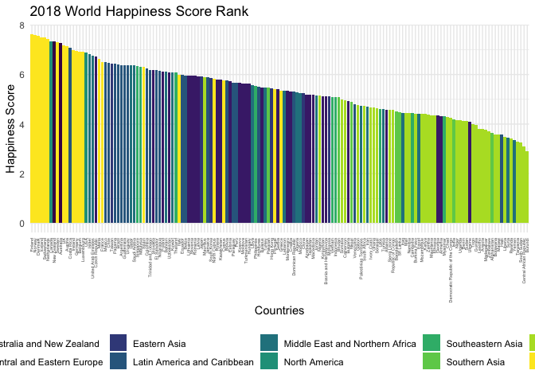
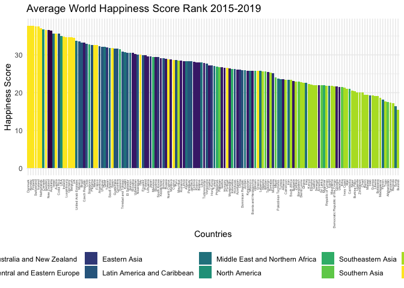
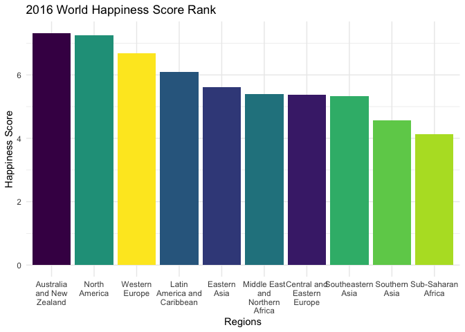
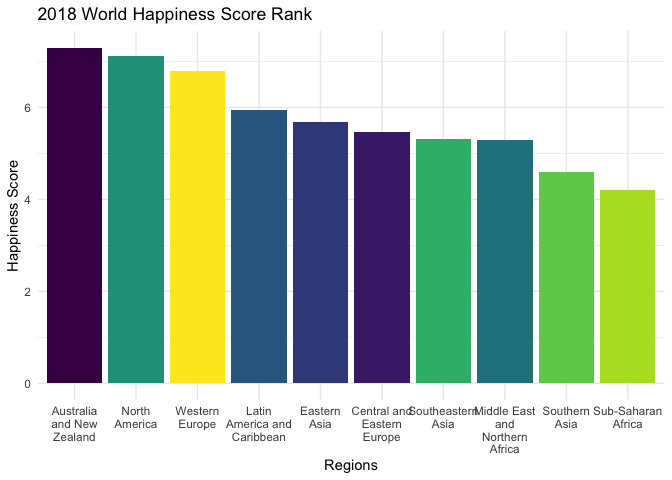

Other Research Questions
================

Import dataset

``` r
combined_happiness = read.csv("./combined_happiness.csv") |>
  janitor::clean_names()

combined_happiness$region[combined_happiness$region == "Eastern Asian"] <- "Eastern Asia"
```

Wordmap Preparation

``` r
iso_codes = countrycode::codelist[, c("un.name.en", "iso3c")]
names(iso_codes) = c("Country", "ISO3")
```

``` r
world_data <- ggplot2::map_data('world')
world_data <- fortify(world_data)
```

``` r
combined_happiness['ISO3'] <- iso_codes$ISO3[match(combined_happiness$country, iso_codes$Country)]
world_data["ISO3"] <- iso_codes$ISO3[match(world_data$region, iso_codes$Country)]
```

``` r
combined_happiness = combined_happiness |>
  mutate(
    ISO3 = if_else(country == "United States", "USA", ISO3),
    ISO3 = if_else(country == "United Kingdom", "GBR", ISO3),
    ISO3 = if_else(country == "Venezuela", "VEN", ISO3),
    ISO3 = if_else(country == "Czech Republic", "CZE", ISO3),
    ISO3 = if_else(country == "Taiwan", "TWN", ISO3),
    ISO3 = if_else(country == "South Korea", "KOR", ISO3),
    ISO3 = if_else(country == "Bolivia", "BOL", ISO3),
    ISO3 = if_else(country == "Moldova", "MDA", ISO3),
    ISO3 = if_else(country == "Russia", "RUS", ISO3),
    ISO3 = if_else(country == "Hong Kong", "CHN", ISO3),
    ISO3 = if_else(country == "Vietnam", "VNM", ISO3),
    ISO3 = if_else(country == "Turkey", "TUR", ISO3),
    ISO3 = if_else(country == "Macedonia", "MKD", ISO3),
    ISO3 = if_else(country == "Laos", "LAO", ISO3),
    ISO3 = if_else(country == "Swaziland", "SWZ", ISO3),
    ISO3 = if_else(country == "Palestinian Territories", "PSE", ISO3),
    ISO3 = if_else(country == "Iran", "IRN", ISO3),
    ISO3 = if_else(country == "Congo (Kinshasa)", "COD", ISO3),
    ISO3 = if_else(country == "Congo (Brazzaville)", "COG", ISO3),
    ISO3 = if_else(country == "Tanzania", "TZA", ISO3),
    ISO3 = if_else(country == "Syria", "SYR", ISO3),
    ISO3 = if_else(country == "Puerto Rico", "PRI", ISO3)
  )|>
  mutate(country = recode(str_trim(country),
                         "United States" = "USA",
                         "United Kingdom" = "UK",
                         "Congo (Kinshasa)" = "Democratic Republic of the Congo",
                         "Congo (Brazzaville)" = "Republic of Congo"))
```

``` r
world_data = world_data|>
  mutate(country = region)|>
  select(-region)

worldjoin <- inner_join(world_data, combined_happiness, by = "country")
```

    ## Warning in inner_join(world_data, combined_happiness, by = "country"): Detected an unexpected many-to-many relationship between `x`
    ## and `y`.
    ## ℹ Row 11 of `x` matches multiple rows in `y`.
    ## ℹ Row 153 of `y` matches multiple rows in `x`.
    ## ℹ If a many-to-many relationship is expected, set
    ##   `relationship = "many-to-many"` to silence this warning.

``` r
## compile all map theme configurations
cleanup <- theme(
  axis.text = element_blank(),
  axis.line = element_blank(),
  axis.ticks = element_blank(),
  panel.border = element_blank(),
  panel.grid = element_blank(),
  axis.title = element_blank(),
  panel.background = element_rect(fill = "white"),
  plot.title = element_text(hjust = 0.5)
)
```

# Q1: Which country has the highest and lowest happiness score?

In order to explore the distribution of happiness score all over the
world, we draw bar charts of happiness score for each year in descending
order showing different region with color and legends. We also use heat
map in world map to show the geographic distribution of happiness score
over the world.

## 2015

### bar chat

``` r
combined_happiness |>
  filter(year == "2015") |>
  arrange(desc(score)) |>
  ggplot(aes(x = reorder(country, -score), y = score, fill = region)) +
  geom_bar(stat = "identity") +
  labs(title = "2015 World Happiness Score Rank", x = "Countries", y = "Happiness Score") +
  theme(axis.text.x = element_text(angle = 90, vjust = 0.5, hjust=1, size = 4)) +
  theme(legend.position = "bottom")
```

<!-- -->

In year 2015, Switzerland has the highest happiness score while Togo has
the lowest happiness score among 158 countries.

### wordmap

``` r
hp_2015 <- worldjoin |>
  filter(year == "2015") |>
  ggplot(mapping = aes(
    x=long,
    y=lat,
    group=group)) +
  scale_fill_viridis_c(option = "C") +
  coord_fixed(1.3) +
  geom_polygon(aes(fill=score)) +
  ggtitle("Happiness Score 2015") +
  cleanup

hp_2015
```

<!-- -->

In general, countries in Europe, Australia, North and South America have
higher happiness score while countries in Africa and Middle East Asia
has relatively lower happiness score in 2015.

## 2016

``` r
combined_happiness |>
  filter(year == "2016") |>
  arrange(desc(score)) |>
  ggplot(aes(x = reorder(country, -score), y = score, fill = region)) +
  geom_bar(stat = "identity") +
  labs(title = "2016 World Happiness Score Rank", x = "Countries", y = "Happiness Score") +
  theme(axis.text.x = element_text(angle = 90, vjust = 0.5, hjust=1, size = 4)) +
  theme(legend.position = "bottom")
```

<!-- -->

In year 2016, Denmark has the highest happiness score while Burundi has
the lowest happiness score among 157 countries.

### wordmap

``` r
hp_2016 <- worldjoin |>
  filter(year == "2016") |>
  ggplot(mapping = aes(
    x=long,
    y=lat,
    group=group)) +
  scale_fill_viridis_c(option = "C") +
  coord_fixed(1.3) +
  geom_polygon(aes(fill=score)) +
  ggtitle("Happiness Score 2016") +
  cleanup

hp_2016
```

<!-- -->

In general, countries in Europe, Australia, North and South America have
higher happiness score while countries in Africa and Middle East Asia
has relatively lower happiness score in 2016.

## 2017

### bar chat

``` r
combined_happiness |>
  filter(year == "2017") |>
  arrange(desc(score)) |>
  ggplot(aes(x = reorder(country, -score), y = score, fill = region)) +
  geom_bar(stat = "identity") +
  labs(title = "2017 World Happiness Score Rank", x = "Countries", y = "Happiness Score") +
  theme(axis.text.x = element_text(angle = 90, vjust = 0.5, hjust=1, size = 4)) +
  theme(legend.position = "bottom")
```

<!-- -->

In year 2017, Norway has the highest happiness score while Central
African Republic has the lowest happiness score among 155 countries.

### wordmap

``` r
hp_2017 <- worldjoin |>
  filter(year == "2017") |>
  ggplot(mapping = aes(
    x=long,
    y=lat,
    group=group)) +
  scale_fill_viridis_c(option = "C") +
  coord_fixed(1.3) +
  geom_polygon(aes(fill=score)) +
  ggtitle("Happiness Score 2017") +
  cleanup

hp_2017
```

<!-- -->

In general, countries in Europe, Australia, North and South America have
higher happiness score while countries in Africa and Middle East Asia
has relatively lower happiness score in 2017.

## 2018

### bar chart

``` r
combined_happiness |>
  filter(year == "2018") |>
  arrange(desc(score)) |>
  ggplot(aes(x = reorder(country, -score), y = score, fill = region)) +
  geom_bar(stat = "identity") +
  labs(title = "2018 World Happiness Score Rank", x = "Countries", y = "Happiness Score") +
  theme(axis.text.x = element_text(angle = 90, vjust = 0.5, hjust=1, size = 4)) +
  theme(legend.position = "bottom")
```

<!-- -->

In year 2018, Finland has the highest happiness score while Burundi has
the lowest happiness score among 156 countries.

### wordmap

``` r
hp_2018 <- worldjoin |>
  filter(year == "2018") |>
  ggplot(mapping = aes(
    x=long,
    y=lat,
    group=group)) +
  scale_fill_viridis_c(option = "C") +
  coord_fixed(1.3) +
  geom_polygon(aes(fill=score)) +
  ggtitle("Happiness Score 2018") +
  cleanup

hp_2018
```

<!-- -->

In general, countries in Europe, Australia, North and South America have
higher happiness score while countries in Africa and Middle East Asia
has relatively lower happiness score in 2018.

## 2019

### bar chart

``` r
combined_happiness |>
  filter(year == "2019") |>
  arrange(desc(score)) |>
  ggplot(aes(x = reorder(country, -score), y = score, fill = region)) +
  geom_bar(stat = "identity") +
  labs(title = "2019 World Happiness Score Rank", x = "Countries", y = "Happiness Score") +
  theme(axis.text.x = element_text(angle = 90, vjust = 0.5, hjust=1, size = 4)) +
  theme(legend.position = "bottom")
```

<!-- -->

In year 2019, Finland has the highest happiness score while South Sudan
has the lowest happiness score among 156 countries.

### wordmap

``` r
hp_2019 <- worldjoin |>
  filter(year == "2019") |>
  ggplot(mapping = aes(
    x=long,
    y=lat,
    group=group)) +
  scale_fill_viridis_c(option = "C") +
  coord_fixed(1.3) +
  geom_polygon(aes(fill=score)) +
  ggtitle("Happiness Score 2019") +
  cleanup

hp_2019
```

<!-- -->

In general, countries in Europe, Australia, North and South America have
higher happiness score while countries in Africa and Middle East Asia
has relatively lower happiness score in 2019.

## Average in 5 years

### bar chart

``` r
hp_avg = 
combined_happiness |>
  select(year, country, region, score) |>
  pivot_wider(
    names_from = "year",
    values_from = "score"
  ) |>
  na.omit() |>
  pivot_longer(
    "2015":"2019",
    names_to = "year", 
    values_to = "score"
  ) |>
  group_by(year, country) |>
  mutate(score_avg = mean(score)) 

hp_avg|>
  arrange(desc(score_avg)) |>
  ggplot(aes(x = reorder(country, -score_avg), y = score_avg, fill = region)) +
  geom_bar(stat = "identity") +
  labs(title = "Average World Happiness Score Rank 2015-2019", x = "Countries", y = "Happiness Score") +
  theme(axis.text.x = element_text(angle = 90, vjust = 0.5, hjust=1, size = 4)) +
  theme(legend.position = "bottom")
```

<!-- -->

We only keep countries that are in the top rank for all five years.
Among those 144 countries, Danmark has the highest average happiness
score while Burundi has the lowest average happiness score in 5 years.

### wordmap

``` r
wold_avg <- inner_join(world_data, hp_avg, by = "country")
```

    ## Warning in inner_join(world_data, hp_avg, by = "country"): Detected an unexpected many-to-many relationship between `x`
    ## and `y`.
    ## ℹ Row 11 of `x` matches multiple rows in `y`.
    ## ℹ Row 701 of `y` matches multiple rows in `x`.
    ## ℹ If a many-to-many relationship is expected, set
    ##   `relationship = "many-to-many"` to silence this warning.

``` r
hp_avg_plot <- wold_avg |>
  ggplot(mapping = aes(
    x=long,
    y=lat,
    group=group)) +
  scale_fill_viridis_c(option = "C") +
  coord_fixed(1.3) +
  geom_polygon(aes(fill=score_avg)) +
  ggtitle("Average Happiness Score in 5 years") +
  cleanup

hp_avg_plot
```

<!-- -->

In general, countries in Europe, Australia, North and South America have
higher average happiness score while countries in Africa and Middle East
Asia has relatively lower average happiness score from 2015 to 2019.

The geographic distribution of World Happiness Score is stable from 2015
to 2019. European Countries such as Finland, Switzerland, and Danmark
tend to have highest happiness score while African countires such as
South Sudan and Central African Republic tend to have lowest happiness
score. Also, countries in Europe, Australia, North and South America
have higher happiness score while countries in Africa and Middle East
Asia has relatively lower happiness score.

# Q2: Which region has the highest and lowest happiness score?

## 2015

### bar chat

``` r
combined_happiness |>
  filter(year == "2015") |>
  group_by(region) |>
  mutate(region_avg = mean(score)) |>
  arrange(desc(region_avg)) |>
  summarize(region = unique(region), score = unique(region_avg)) |>
  ggplot(aes(x = reorder(region, -score), y = score, fill = region)) +
  geom_bar(stat = "identity") +
  labs(title = "2015 World Happiness Score Rank", x = "Regions", y = "Happiness Score") +
  scale_x_discrete(labels = label_wrap_gen(width = 12)) +
  theme(legend.position = "none")
```

<!-- -->

In year 2015, Australia and New Zealand has the highest happiness score
while Sub-Saharan Africa has the lowest happiness score among 10
regions.

## 2016

### bar chart

``` r
combined_happiness |>
  filter(year == "2016") |>
  group_by(region) |>
  mutate(region_avg = mean(score)) |>
  arrange(desc(region_avg)) |>
  summarize(region = unique(region), score = unique(region_avg)) |>
  ggplot(aes(x = reorder(region, -score), y = score, fill = region)) +
  geom_bar(stat = "identity") +
  labs(title = "2016 World Happiness Score Rank", x = "Regions", y = "Happiness Score") +
  scale_x_discrete(labels = label_wrap_gen(width = 12)) +
  theme(legend.position = "none")
```

<!-- -->

In year 2016, Australia and New Zealand has the highest happiness score
while Sub-Saharan Africa has the lowest happiness score among 10
regions.

## 2017

### bar chat

``` r
combined_happiness |>
  filter(year == "2017") |>
  group_by(region) |>
  mutate(region_avg = mean(score)) |>
  arrange(desc(region_avg)) |>
  summarize(region = unique(region), score = unique(region_avg)) |>
  ggplot(aes(x = reorder(region, -score), y = score, fill = region)) +
  geom_bar(stat = "identity") +
  labs(title = "2017 World Happiness Score Rank", x = "Regions", y = "Happiness Score") +
  scale_x_discrete(labels = label_wrap_gen(width = 12)) +
  theme(legend.position = "none")
```

<!-- -->

In year 2017, Australia and New Zealand has the highest happiness score
while Sub-Saharan Africa has the lowest happiness score among 10
regions.

## 2018

### bar chart

``` r
combined_happiness |>
  filter(year == "2018") |>
  group_by(region) |>
  mutate(region_avg = mean(score)) |>
  arrange(desc(region_avg)) |>
  summarize(region = unique(region), score = unique(region_avg)) |>
  ggplot(aes(x = reorder(region, -score), y = score, fill = region)) +
  geom_bar(stat = "identity") +
  labs(title = "2018 World Happiness Score Rank", x = "Regions", y = "Happiness Score") +
  scale_x_discrete(labels = label_wrap_gen(width = 12)) +
  theme(legend.position = "none")
```

<!-- -->

In year 2018, Australia and New Zealand has the highest happiness score
while Sub-Saharan Africa has the lowest happiness score among 10
regions.

## 2019

### bar chart

``` r
combined_happiness |>
  filter(year == "2019") |>
  group_by(region) |>
  mutate(region_avg = mean(score)) |>
  arrange(desc(region_avg)) |>
  summarize(region = unique(region), score = unique(region_avg)) |>
  ggplot(aes(x = reorder(region, -score), y = score, fill = region)) +
  geom_bar(stat = "identity") +
  labs(title = "2019 World Happiness Score Rank", x = "Regions", y = "Happiness Score") +
  scale_x_discrete(labels = label_wrap_gen(width = 12)) +
  theme(legend.position = "none")
```

<!-- -->

In year 2019, Australia and New Zealand has the highest happiness score
while Sub-Saharan Africa has the lowest happiness score among 10
regions.

## Average in 5 years

### bar chart

``` r
hp_avg|>
  group_by(region) |>
  mutate(region_avg = mean(score)) |>
  arrange(desc(score_avg)) |>
  summarize(region = unique(region), score = unique(region_avg)) |>
  ggplot(aes(x = reorder(region, -score), y = score, fill = region)) +
  geom_bar(stat = "identity") +
  labs(title = "Average World Happiness Score Rank 2015-2019", x = "Countries", y = "Happiness Score") +
  scale_x_discrete(labels = label_wrap_gen(width = 12)) +
  theme(legend.position = "none")
```

<!-- -->

From 2015 to 2019, Australia and New Zealand has the highest average
happiness score while Sub-Saharan Africa has the lowest average
happiness score among 10 regions.

# Q3: What are some trends of mean happiness score in different regions from 2015 – 2019?

``` r
combined_happiness |>
  group_by(year, region) |>
  mutate(region_avg = mean(score)) |>
  arrange(desc(region_avg)) |>
  summarize(region = unique(region), score = unique(region_avg)) |>
  ggplot(aes(x = year, y = score, color = region)) +
  geom_point() + 
  geom_line() +
  labs(title = "World Happiness Score Trend in 10 Regions", x = "year", y = "Happiness Score")
```

    ## `summarise()` has grouped output by 'year'. You can override
    ## using the `.groups` argument.

<!-- -->

According to the scatter plot, from 2015 to 2019, Australia and New
Zealand has stable happiness scores and it’s the highest amnong 10
regions. North America has second highest happiness score among 10
regions with the highest happiness score in year 2015 and gradually
decreasing trend. Western Europe has the third highest happiness score
with an increasing trend in 5 years. Latin America and Caribbean has the
fourth highest happiness score with a decreasing trend in 5 years.
Eastern Asia has the fifth highest happiness score with a stable trend.
Middle East and Northern Africa, Southeastern Asia, and Central and
Eastern Europe have comparative happiness score from 2015 to 2017, but
Central and Eastern Europe has a increasing trend and higher happiness
score after year 2017 while the other two regions have a decreasing
trend and lower happiness score after year 2017. Southern Asia and
Sub-Saharan Africa has the second lowest and lowest happiness score in 5
years, respectively. However, Sub-Saharan Africa has shown an increasing
trend while Southern Asia has shown an decreasing trend since year 2017.
