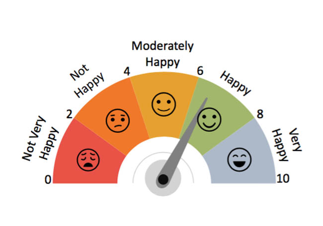

# Motivation

Happiness is a critical measure of social progress. Understanding what drives happiness can help in formulating policies that improve the quality of life for citizens.By studying the factors that affect happiness, we can contribute to a multidisciplinary understanding of well-being, which in turn can inform a variety of practical applications aimed at improving people’s lives at both the individual and collective levels.


# Screencast
```{r}
vembedr::embed_url("https://youtu.be/egirmuVnMV0")
```

# Project Information


## About

In this section, we introduce our team member.

[To The Page](About.html)


## Data

In this section, we introduce the data source, background, and how we clean and tidy the dataset.

[To The Page](Data.html)


## Regression Analysis

In this section, we run regression analysis to explore our main research question: what are factors influence happiness scores around the world from 2015 to 2019?

[To The Page](Regression_Analysis.html)


## Exploratory Data Analysis

In this section, we explore other research questions related to the distribution of happiness score and six factors that we are interested in.

[To The Page](EDA.html)


## Final Report

In this section, we composite a final report based on our exploration process and results.

[To The Page](Final-Report.html)


